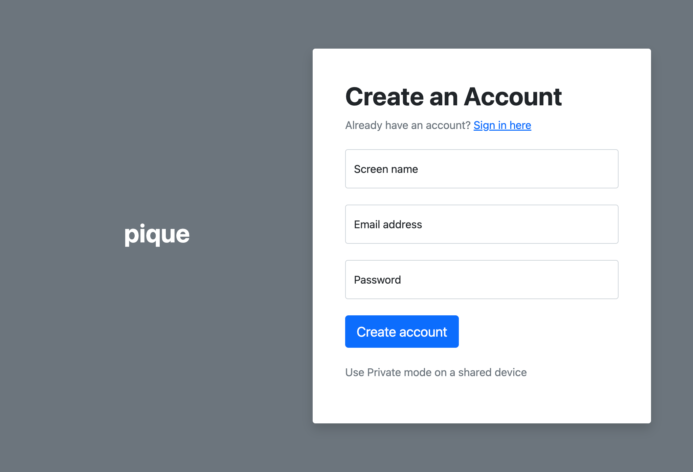
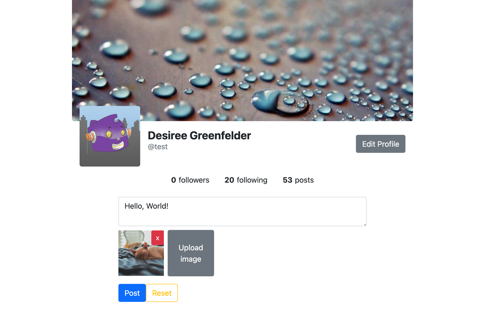
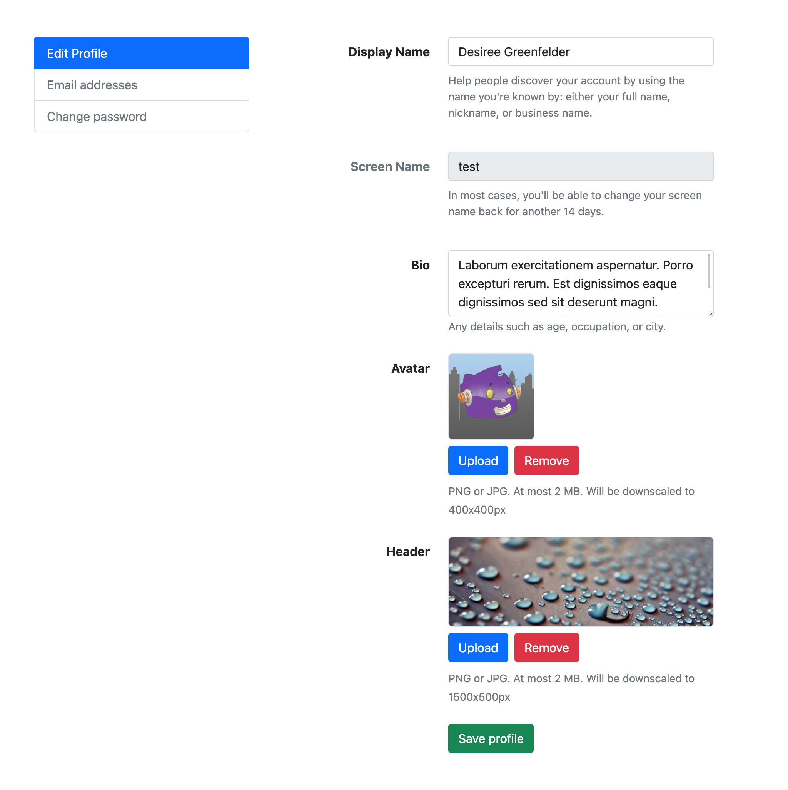
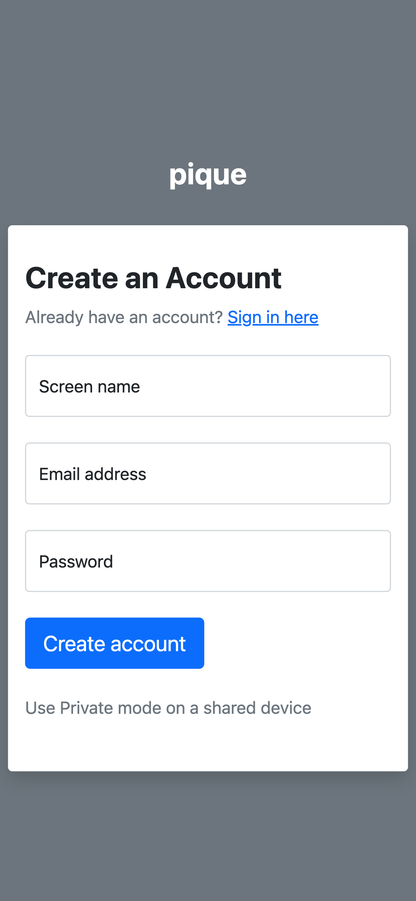
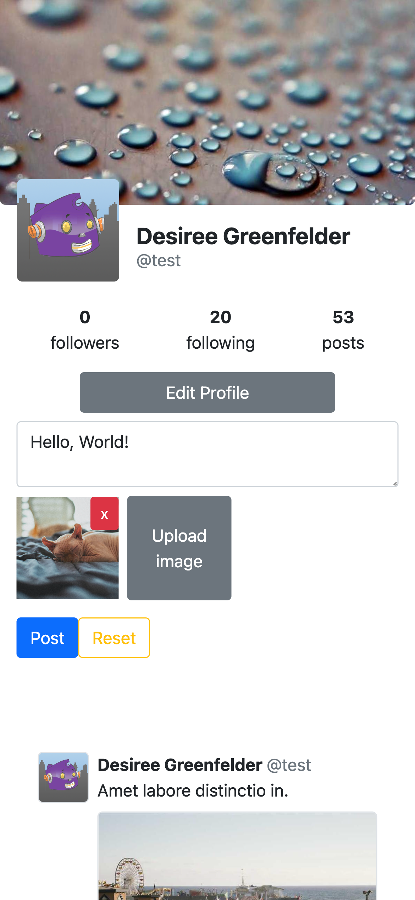
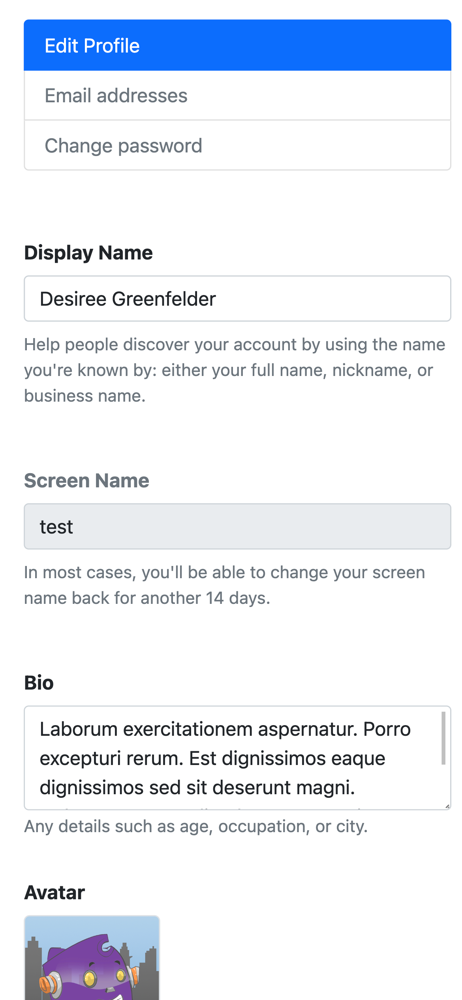
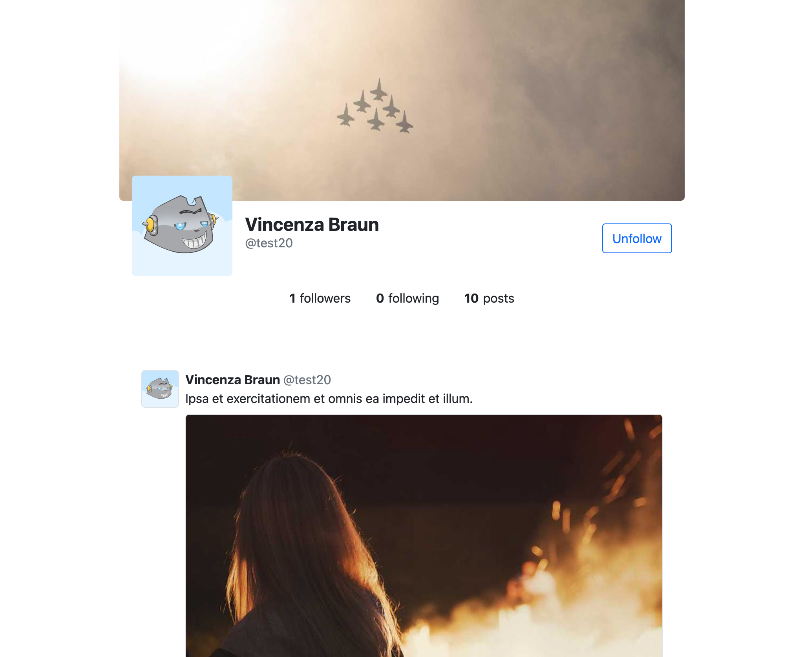
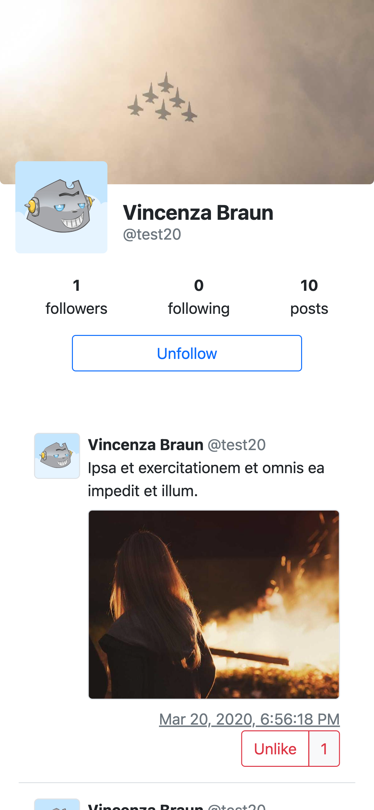
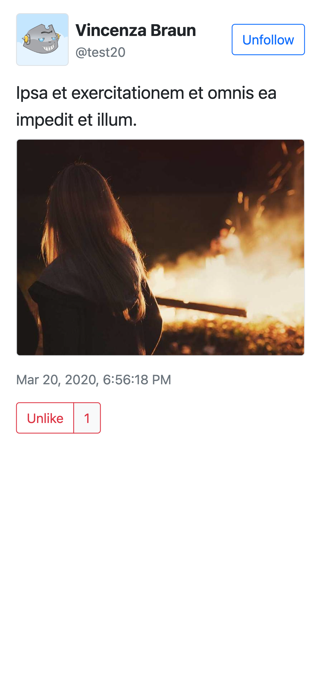

# pique

This is a Twitter-like social web application that allows users to sign in, sign up, post messages, upload images, follow profiles, like posts, and view their feed.

## Technologies

### Back-end

TypeScript, Node.js, NestJS, TypeORM, SQLite

### Front-end

TypeScript, Angular 2+, NgRx

# Features

- Register and sign in to an account
- Profiles
  - View your own profile
  - View other users' profiles
  - Follow other users
  - Edit your own profile
    - Change your name, bio
    - Upload a profile picture and banner
- Posts
  - Create posts
    - Upload multiple images to posts
    - Save a draft of an unfinished post
  - Like posts
  - View own and other users' posts
  - Feed, which shows posts from users you follow

## Installation

To install this project, you need to have Node.js and npm installed on your machine. Then follow these steps:

1. Clone this repository to your local machine.
2. Navigate to the root directory of the project.
3. Run `yarn` to install the dependencies for both back- and front- end.
4. Navigate to the `backend` directory and run `yarn run migrate:run` to run the database migrations.
5. (optional) Run `yarn run seed:dummy` to seed the database with some dummy data.
6. Run `yarn run start:dev` to start the back-end server in development mode.
7. Navigate to the `frontend` directory and run `yarn run dev` to start the front-end server in development mode.
8. Open your browser and go to `http://localhost:4200` to see the application. Swagger API documentation is available at `http://localhost:3000/api`.

## Usage

To use this application, you need to sign up for an account. You can also use the dummy account with the following credentials:

- Email: `test@example.com`
- Password: `123456`

## Screenshots

|                                      **Register Form**                                      |                                     **Own Profile**                                     |                                     **Profile Edit**                                      |
| :-----------------------------------------------------------------------------------------: | :-------------------------------------------------------------------------------------: | :---------------------------------------------------------------------------------------: |
|  |  |  |
|    |    |    |

|                                      **Other Profile**                                      |                                 **Post**                                  |
| :-----------------------------------------------------------------------------------------: | :-----------------------------------------------------------------------: |
|  |  |
|    |    |
